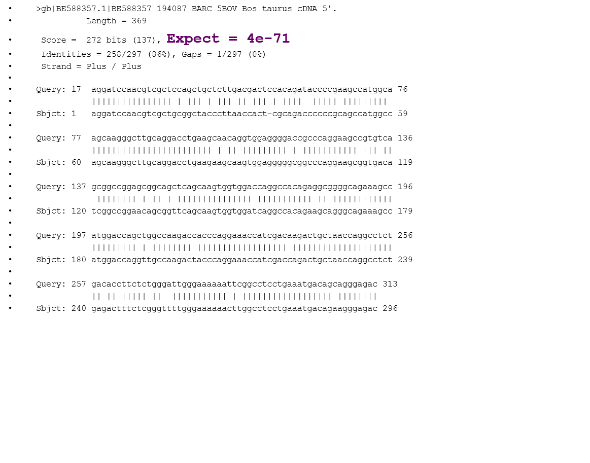
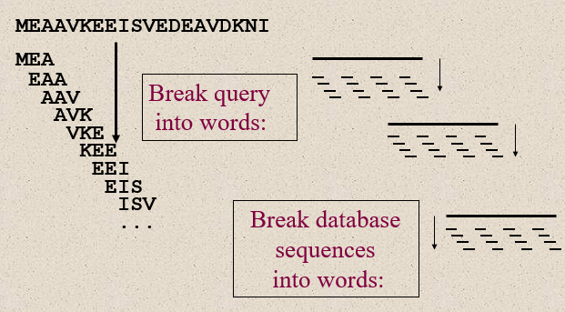
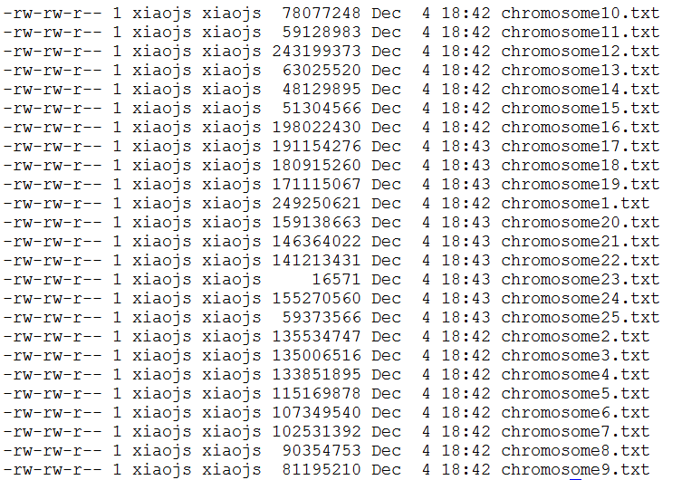
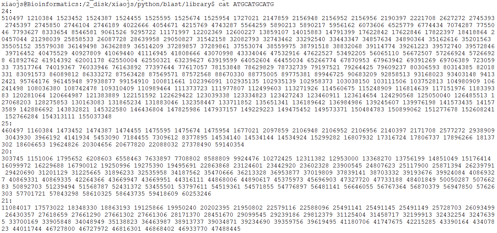
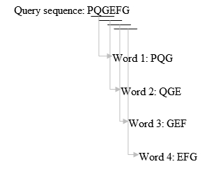
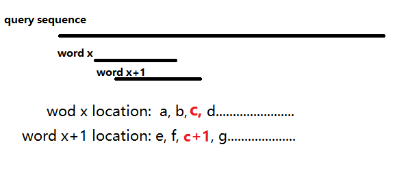
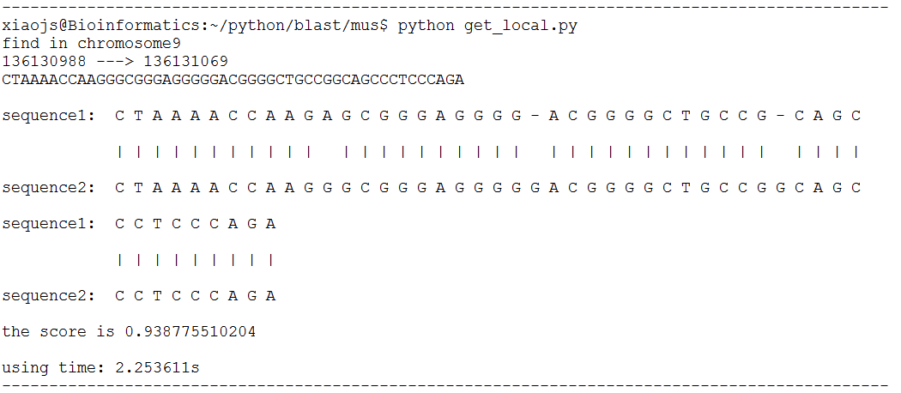

# python implement fast BLAST 
Python implementation of Basic Local Alignment Search Tool (BLAST) , which is the core algorithm in sequence alignmenrt for genomes.

This is the course project for Bioinformatics(BI3204 2015.09-2016.01) at [SUSTC](http://www.sustc.edu.cn/).

**Table of Contents**

- [Introduction to BLAST](#Introduction-to-BLAST)
- [BLAST implementation in python: For human genome](##BLAST-implementation-in-python:-For-human-genome)
  - [construct library](#construct-library)
  - [alignment algrithms](#alignment-algrithms)

##Introduction to BLAST



>In bioinformatics, BLAST for Basic Local Alignment Search Tool is an algorithm for comparing primary biological sequence information, such as the amino-acid sequences of different proteins or the nucleotides of DNA sequences. A BLAST search enables a researcher to compare a query sequence with a library or database of sequences, and identify library sequences that resemble the query sequence above a certain threshold.

>BLAST.  In Wikipedia. Retrieved May 12, 2016, from https://en.wikipedia.org/wiki/BLAST


##BLAST implementation in python: For human genome
###Construct library

>Construct library for human genome. Break whole genome sequence into **11** bases length words overlappedly (**respectively for each chromosome**), every word as a name of a txt file which contain all lolation of this words in genome sequence. So was the query reads.
####Detail programing 
```bash 
python chromosome.py hg19.fa
# firstly, cut hg19.fa into individual chromosomes 
# this will output 25 txt file.
```

```bash
python construct_library.py 
# secondly, cut each chromosme into 11 bases length words overlappedly.
# this will output total 37G files.
```


####alignment algrithms

>Align query sequence with genome. after cut query sequences into 11 bases length, find all location of each reads by open library files we construct above. 


>Compare all locations between each 11 bases length words of query sequences. for each words, it will have many location in each chromosome, but only one of them is the right location of query sequnce. for example, as we can see in figue above, word x have locations: a, b, **c**, d..., c is the right location; word x+1 have locations: e, f, **c+1**, g........... c+1 is the right location. Thus, if the query sequence have no mutation and gaps, all the words will have a location like that: **c, c+1, c+2, c+3, c+4..........** besides, if the query sequence have mutation or gaps, all the words will have a location like that: **c, c+1, c+2, c+3,----------------,c+14,c+15.... **in orther words, a mutation or gaps will cause 11 wods have no right location. Then, for words from first one to last, locations of each word add length(query) - i, i is the index of words, so we can get the new locations like that: **c+length(query), c+1+length(query)-1, c+2+length(query)-2............. **, finally, we can find the right location of the highest repeated location:**c+length(query)**, and we can select the bigger threshold of the highest repeated location just like we select the highly similar sequence in NCBI BLAST. the result figure is showed below, we can see the time to find the location and finish sequence alignment  only need 2 seconds.
```bash 
python blast.py 
# finally, input query sequence in blast.py 
# this will output location and Smith,Waterman alignment result.
```


