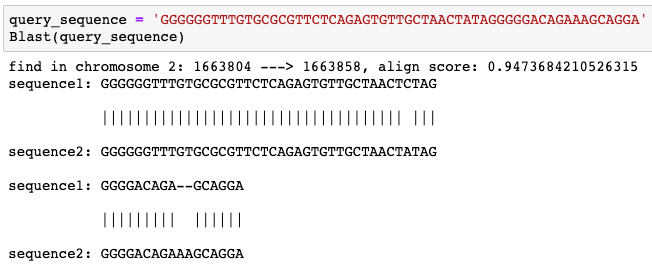

# python implement fast BLAST 
Python implementation of Basic Local Alignment Search Tool (BLAST) , which is the core algorithm in sequence alignment for genomes and only need about 2 seconds to output location and Smith,Waterman alignment result.

**Table of Contents**

- [Introduction to BLAST](#Introduction-to-BLAST)
- [BLAST implementation in python: For human genome](#Blast-implementation-in-python:-for-human-genome)
  - [construct library](#construct-library)
  - [alignment algrithms](#alignment-algrithms)

## Introduction to BLAST

> In bioinformatics, BLAST for Basic Local Alignment Search Tool is an algorithm for comparing primary biological sequence information, such as the amino-acid sequences of different proteins or the nucleotides of DNA sequences. A BLAST search enables a researcher to compare a query sequence with a library or database of sequences, and identify library sequences that resemble the query sequence above a certain threshold.

## BLAST implementation in python: For human genome

### Construct library
>Construct library for human genome. Break whole genome sequence into **11** bases length words overlappedly, then record the location of each word in liarary file. (**respectively for each chromosome**)


#### Detail programing 

```python
python build_library.py 
# It takes several hours when multiprocessing was applicable
# reset GRCh37 path and output library file path
```

### alignment algorithms
> Align query sequence with genome. after cut query sequences into 11 bases length, find all location of each reads from library files we build above. 


> Compare all locations between each 11 bases length words of query sequences. For each words, it will have many location in each chromosome, but only one of them is the right location of query sequnce. For example, as we can see in figue above, word x have locations: a, b, **c**, d..., c is the right location; word x+1 have locations: e, f, **c+1**, g........... c+1 is the right location. Thus, if the query sequence have no mutation and gaps, each word will have a location like that: **c, c+1, c+2, c+3,..........** repectively. However, if the query sequence have a mutation or gap, all the words contain the muation of gap will have misleading postions, like that: **c, c+1, c+2,...,c+i-11, misleading postions ,c+i+11....**. Then, for words from first one to last, locations of each word add length(query) - i, i is the index of words, so we can get the new locations like that: **c+length(query), c+1+length(query)-1, c+2+length(query)-2.......... finally, we can find the right location of the highest repeated location: c+length(query)**, and we can select the bigger threshold of the highest repeated number (default: 5) just like we select the highly similar sequence in NCBI BLAST. the result figure is showed below, The time to find the location and finish sequence alignment is about 2 seconds.

```python 
python blast.py 
# finally, input query sequence in blast.py 
# this will output location and Smith,Waterman alignment result.
```




